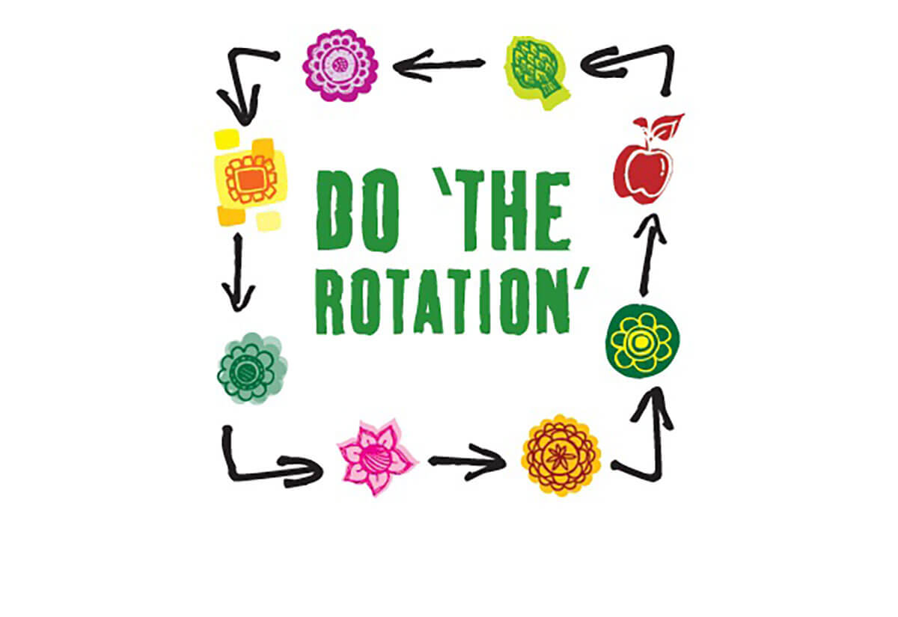
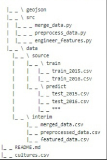

# Crop rotation patterns (DVHB Project case)

![Entry level: beginner][badge-beginner]

# Project details

This project is aimed at helping farmers in France in gaining basic knowledge on culture crop to seed the next year.

The project is made within the course of Skillfactory and based on the materials from DVHB company
and is intended to complement for beginners.

## Table of Contents

- [Repo structure](#repo-structure)
- [Learning hints](#learning-hints)
- [Results](#learning-hints)
- [Extras](#extras)
- [What's next?](#whats-next)

## Repo structure

Below is brief description of project. 
However, check the contents and extra materials we used
before you decide to go deeper into the project results. 
You still may find something new or useful.

## Learning hints

We tried to add additional features to gain better performance:

* Culture and culture group codes of previous years
* Some farmers use culture rotation strategies for their fields, so
  * Rotation length
  * Encoded rotation pattern (for example: 'aaaa', 'abab', 'abca', 'aabb'...)
* Depending on the weather it may be more reasonable to grow one culture or another, so
  * Hardiness zone of field
  * Köppen climate class
  * First frost index
* It may be possible that planting crops strategy of one farmer is depended in some way by it's neighbor's strategies, so we can try to add information about 4 nearest neighbors.
* The variety of cultures in region

## Extras

* [Data source](https://www.data.gouv.fr/en/datasets/registre-parcellaire-graphique-rpg-contours-des-parcelles-et-ilots-culturaux-et-leur-groupe-de-cultures-majoritaire/#_)
* [Nomenclature naming (2015 year)](https://www3.telepac.agriculture.gouv.fr/telepac/pdf/tas/2015/Dossier-PAC-2015_notice_cultures-precisions.pdf)
* [Nomenclature naming (2016 year)](https://www3.telepac.agriculture.gouv.fr/telepac/pdf/tas/2016/Dossier-PAC-2016_notice_cultures-precisions.pdf)
* [Nomenclature naming (2017 year)](https://www1.telepac.agriculture.gouv.fr/telepac/pdf/tas/2017/Dossier-PAC-2017_notice_cultures-precisions.pdf)
* [Nomenclature naming (2018 year)](https://www1.telepac.agriculture.gouv.fr/telepac/pdf/tas/2018/Dossier-PAC-2018_notice_cultures-precisions.pdf)
* [Nomenclature naming (2019 year)](https://www.telepac.agriculture.gouv.fr/telepac/pdf/tas/2019/Dossier-PAC-2019_notice_cultures-precisions.pdf)
* [Nomenclature naming (2020 year)](https://www3.telepac.agriculture.gouv.fr/telepac/pdf/tas/2020/Dossier-PAC-2020_notice_cultures-precisions.pdf)
* [Description of rules for using nomenclature](https://www.essonne.gouv.fr/Politiques-publiques/Agriculture-et-foret/Agriculture/Les-Aides-pour-l-Agriculture/PAC-Les-Aides-a-la-production/La-declaration-PAC/La-declaration-PAC-2020)
* [Weather maps](https://www.plantmaps.com/)
   
## What's next?

In case we have data on efficiency the reliability and the ROI of project wil be increased manually.

---

[badge-beginner]: https://img.shields.io/badge/Entry%20level-beginner-brightgreen.svg
